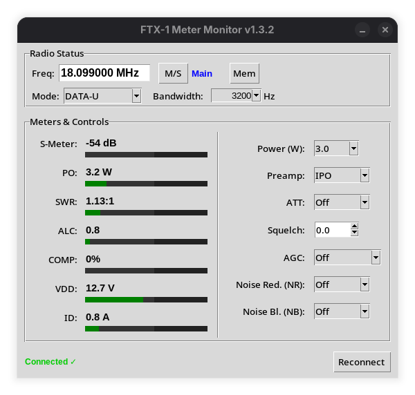

# FTX-1 Meter Monitor

A lightweight, real-time monitoring and control application for the Yaesu FTX-1 transceiver using Hamlib's NET rigctl (via `rigctld`).

This tool is designed for Linux users (tested on Fedora) who run WSJT-X or other ham software and want a clean, dedicated meter panel for S-Meter, PO, SWR, ALC, COMP, VDD, and ID — plus basic control over settable parameters.

### Features

- Real-time meters with thin horizontal progress bars (S-Meter in dB, PO in W, SWR, ALC, COMP, VDD, ID)
- EMA smoothing for stable, flicker-free readings
- Startup sync — reads current radio settings on launch (no overwriting)
- Right-column controls for:
  - Power (read-only display — set not yet supported by Hamlib backend)
  - Preamp (read-only: IPO / AMP1 / AMP2)
  - ATT (read-only: Off / -6 / -12 / -18 dB)
  - Squelch (settable 0.0–1.0)
  - AGC (settable: Off / Fast / Medium / Slow / Auto)
  - NR (Noise Reduction) — settable 0–9
  - NB (Noise Blanker) — settable 0–9
  - Mode selector + PRESET checkbox (settable)
- Green text confirmation when polled value matches last set (on settable items)
- Auto-apply on change, 12-second ignore timer to prevent snap-back
- Remote capable — works over LAN/Internet as long as rigctld is running

### Requirements

- Python 3.9+ (tested on 3.12)
- Tkinter (Fedora: `sudo dnf install python3-tkinter`)
- Hamlib with WSJT-X bundled rigctld (or system hamlib package) >= 4.7
- Yaesu FTX-1 connected via USB (CAT port)

No external pip packages needed.

### Usage

To start rigctld (example):

```bash
rigctld -m 1051 -r /dev/ttyUSB0 -s 38400 -t 4532 &
```
```bash
python3 ftx1_meter.py
```
add -d to the command-line for DEBUG output

### Known Limitations

PRESET, the selector that goes with the mode, does not exist in CAT

### Future Enhancements (planned / ideas)

TX detect (highlight TX meters when PO > 0.1 W)
Graphical gauges (circular S-meter, vertical PO/SWR)
Config file (host/port, window position, defaults)
Tooltips & help labels for controls

### Contributing
Bug reports, feature requests, pull requests welcome!
