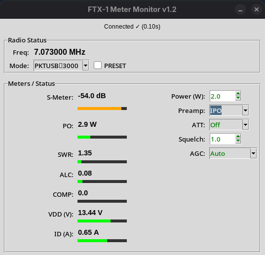

# FTX-1 Meter Monitor

A simple, lightweight Python/Tkinter application for monitoring and controlling the Yaesu FTX-1 transceiver using Hamlib's NET rigctl (rigctld-wsjtx).

Features:
- Real-time meters: S-Meter (dB), PO (W), SWR, ALC, COMP, VDD (V), ID (A)
- Thin horizontal progress bars with color thresholds
- EMA smoothing for stable readings
- Controls: Power (0.5–10.0 W), Preamp (IPO/AMP1/AMP2), ATT (Off/-6/-12/-18 dB), Squelch (0–1), AGC (Off/Fast/Medium/Slow/Auto), Mode + PRESET
- Startup sync: reads current radio settings (no overwrite)
- Auto-apply on change, green confirmation on read-back match


### Requirements

- Python 3 (3.12+ recommended)
- Tkinter: `sudo dnf install python3-tkinter` (Fedora)
- Hamlib: WSJT-X bundled `rigctld-wsjtx` or system `hamlib` package

### Usage

To start rigctld-wsjtx (example):

```bash
rigctld-wsjtx -m 1051 -r /dev/ttyUSB0 -s 38400 -t 4532 &
```
```bash
python3 ftx1_meter.py
```

### Future enhancements

- TX detect (poll PTT or watch PO > 0.1 W) to highlight TX meters
- Graphical gauges (circular for S-meter, vertical for PO/SWR/ALC)
- Smoothing on text values (EMA on all meters)
- CSV logging (power/SWR/ALC over time, on TX or manual)
- Config file (save host/port, window position, default settings)
- Better AGC/preamp mapping (verify exact values from FTX-1 CAT manual)
- Tooltips & help labels for controls
- Error handling & reconnect button polish
- Packaging (Flatpak/AppImage for easier distribution)

